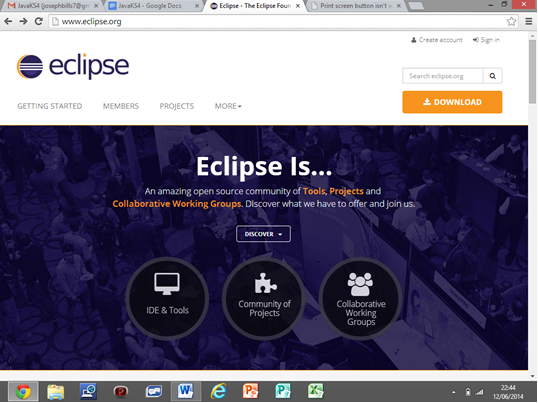
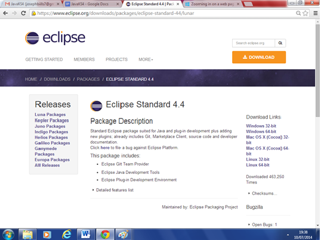
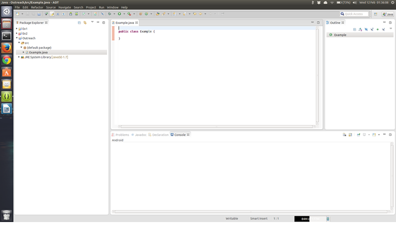

Installing Eclipse
===

You will be using a program called Eclipse to complete their exercises in. Eclipse is an example of an IDE, which stands for **Integrated Development Environment**. In short, an IDE is an application which contains a set of tools used to create programs in whichever language you are using. The main tools which you and your students will be using are an editor which is used to write and edit code, and an interpreter. I have mentioned the interpreter here, however you do not explicitly use the interpreter, it simply runs without you doing anything. As you type in code, the interpreter will constantly check to see if the syntax of your code is correct and that you have not made any silly mistakes. So you can imagine the interpreter as being an English teacher who is constantly checking to see if your grammar/punctuation (syntax) is correct whilst you write sentences, or in our case, code. As the interpreter is running all the time it means that if you are typing in code and you have not yet finished writing the line, you may encounter errors and your code may be underlined in red. This is nothing to worry about and will only be a problem when you finish writing the line, at which point you need to do some investigative work. Try to see if you have made a silly mistake, and if that endeavour bears no fruit, read the error and try to understand what it is trying to tell you, and then correct the mistake. This process of finding and eliminating errors is known as **debugging**.

So now we will cover how to install Eclipse:

First, head over to Eclipse's website, which looks like this:



Next click the orange downloads button to take you to:


Now click "eclipse standard", the first one listed, the latest version at the time of writing is version 4.4:



Now under download links, you should see your OS (Operating System). Click it:


Next, click where it says "[United Kingdom] UK Mirror Service (http)":


Now save the file. Once it has finished downloading, open and extract it.

Now simply double click on the eclipse file and Eclipse will now open. If you have had any problems during installation, please consult your School's IT department or your teacher.

## What this course entails
Hello, and welcome to your new Java class. My name is Jarvis, and I am your new Java teacher. I will be helping you through the first part of your course.  To begin with, I will explain some simple concepts to you.

In this course you will learn how to program in Java and then Swing.  You can think of programming as a way of making your computer do things - and anything that you create and run on your computer is called a program.  Programs can be seen as a set of instructions that get executed when you run the program. The instructions for programs cannot be written in plain English; they must be written in different languages, one of which is Java.  Anything you write in Java is called code, and lines of code look very similar to sentences.  However there are some key differences, such as that lines of code end in a semi-colon (;) not a full-stop.  The tool that you will use to write Java is called Eclipse.  Eclipse will highlight different bits of your code so that you can see the different bits of code more clearly.  The code you write in Eclipse will tell your program what you want it to do when you run your code.  With that explained, on with the programming!

1) Open up Eclipse (your teacher should have explained how to do this).
It should look something like the screen shot below:


The green icon which looks like this is used to run your programs. It can be found in the top bar and you have to click it to run the current program you are working in. Provided that your program has no errors, your program should run.


Now right-click Outreach then click New->Class and you should see the following pop-up:


Where it says name type in Example then click Finish, and so your screen should look like this:


Notice the words `public class` in purple.  A class is a file which contains objects and methods (see descriptions in the respective sections (Methods and Classes). The word 'public' just means that the piece of code can be used in other classes. The other word that we could have written in that space would be 'private', so that only the class that we are currently in can use the piece of code.

At the top of a Java program, usually you can find a comment or two stating the name of the person who wrote the program and a note on what the program does.  To write words and sentences in a program that other people can see when they look at your code, but isn't visible to the computer when you run your program, write `//` at the start of the sentence you want to write.  So, I would write:

```java
// By Jarvis, this is an example program.
```

This is to let other people who view my program know that the code was written by me, and likewise you would write your own name and the purpose of your program.

Now copy and paste this piece of code into your class:

```java
public static void main(String[] args) {
		
}
```

This is the main method, and every Java program needs a main method.  It is the first bit of code your program looks at when it is run.  If you have more than one main method, your program will get confused and will not know what to do.  (Where should it be starting from? This main method or that one?) So, the point is, you can only have ONE main method per program. You can run other methods from the main method too.  The main method must always begin with that line and look like the screenshot above, and you cannot change the name of the main method. Bear in mind that by the end of your course, you will have been able to memorise the piece of code above.
