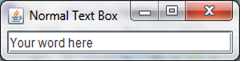
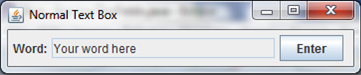
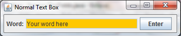
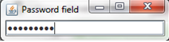
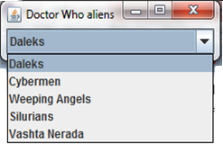
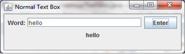
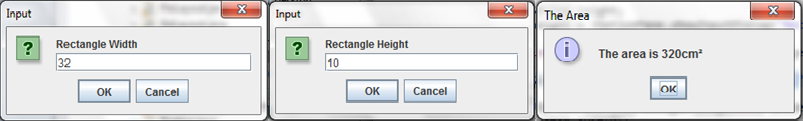
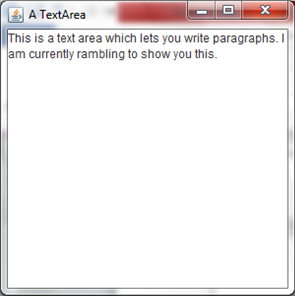
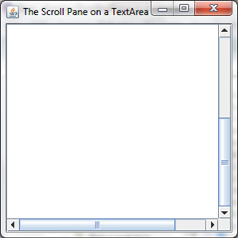
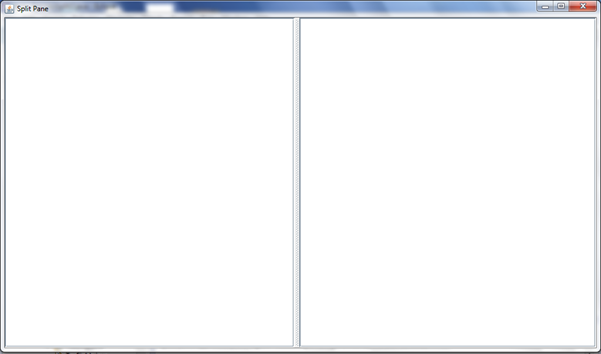

Text Fields
===

In Java there are are 3 main types of text field - the normal textfield, the password field and the drop-down menu. What these are and how they work will be explained in this chapter. As an introduction, if there is any doubt as to what a text field is, a text field is a box that lets the user input a small amount of text. As a passing statement, these textfields interact with the layouts introduced in that last part just as buttons do.

## JTextField
What a normal text field is was just explained, it is a way for the user to input text. (Identical to the `<input>` tag in HTML). To create one, copy out the following:

```java
import javax.swing.JFrame;
import javax.swing.JTextField;

public class TexFields extends JFrame {
	JTextField normal = new JTextField();
	// The empty brackets can be filled with an integer to dictate the preffered size of the text field.
	
	public TexFields() {
		add(normal);
		
		setTitle("Normal Text Box");
		setVisible(true);
		setDefaultCloseOperation(EXIT_ON_CLOSE);
		pack();
	}
	
	public static void main(String[] args) {
		new TexFields();
	}
}
```

This displays a normal text field that text can be inputted into. Inside the brackets on Line 5 you can enter a few things. If you enter a string, you will create the background text that you first get when you run the program. If you were to enter an integer, this would dictate the size of the text field. You can enter both of course, and you would do so using the following code:

```java
JTextField normal = new JTextField("Your word here", 15);
```

This would output the following:



You can also make these text fields uneditable. Therefore you could, theoretically, have the user input something and then lock the text field to prevent anything else being inputted. You can stop the text fields accepting text using the following code:

```java
normal.setEditable(false);
//where 'normal' is the identifier of the text field
```

The following would be outputted if this is combined with the other pieces of code:



Finally, you can colour your text fields. I'm not going to give an example of this because the code is identical to how you would colour a JFrame, only you don't have to include the `getContentPane()`. If yuo were to colour your text filed orange, then it would look like this:



### Ex 1
Create your own text field and run it. Try to input some text. If you wish, put an integer into line 5 to dictate the size of the text field. You could also make the text field uneditable, if you so desire.

## JPasswordField
Whenever you have to enter a password into a website, what you type in is obscured by black dots. This is a result of the password field. To create this you will have to use the above syntax, but will have to import and use `JPasswordField`.

### Ex 2
Create a password field and see what happens when you try to type something in. Your finished product should look something like this:



## JComboBox
A JComboBox, otherwise known as a drop-down menu, is a text field that lets you choose from a preset list of options that, quite literally, drop down when you click a button. To do this you will have to import and use `JComboBox`. To use this you will have to declare an array which includes all of the options. You can see how to declare an array in Chapter 1 Part VI. You will then have to put the name of the array in the parameters that the `JComboBox` has. In other words: 

```java
JComboBox DoctorWho = new JComboBox(monsters);
//where 'monsters' is the name of a String array.
```

### Ex 3
Create a drop-down menu with 5 different options. It does not have to be about Doctor Who and/or monsters. Your end result should look something like this (bear in mind that I've used aliens from Doctor Who):



## Accepting and using user input
It's all very well having a text field on your screen, but it has no purpose if you cannot use what the user has inputted. Therefore for your text field to be fully working, you need to be able to accept and use these inputs. There are two main ways to do this, one using the above formats of text field; and one which uses a whole new format i.e. The `JOptionPane`. I will explain both of these in detail shortly.

## Using a JTextField
It can be very easy to store a user's input and manipulate it. For example you can display the user's input on the screen. To do this, all you really need to do is set a variable to be the input, and then set a label to be that variable. In other words, you can use the following code inside the actionPerformed method:

```java
public void actionPerformed(ActionEvent evt) {
	    String text = normal.getText();
	    label.setText(text);
	    //where label is the name of a JLabel
	}
```

Add this to a button, text field and a label, and you can create something like the following:



This simply displays the user's input, but since `normal.getText()` stores the user's input, you could just as easily validate or manipulate the input.

### Ex 4
Convert your code to work with a password field - What is outputted?
See what happens with other text fields, or try to manipulate the user's input.

## Using a JOptionPane
JOptionPanes are another option for accepting the user's input. They are essentially pre-built JFrames with JTextFields that are designed to look good and be opened in another window. To use a JOptionPane, you will first have to import `javax.swing.JOptionPane`. These panes use a different syntax to a normal text field, and only require one line for code. To create a JOptionPane you simply need to declare a variable e.g. `width` and then type this in:

```java
width = JOptionPane.showInputDialog("Width", "Enter the width");
//the first parameter is the title and the second is the background text. 
```

This will create a pane, you don't have to add it, and it stores the input as soon as the OK button is pressed. For that matter, it comes pre-styled and with its own buttons. Whereas you would have to set a title; set the frame to be visible; set a DefaultCloseOperation etc with a JTextField, you don't have to do any of that with JOptionPanes. You can therefore use these easily. Since they can be used to manipulate inputs, they could be compared to methods. For example, you could use a method to work out the area of a rectangle based on two inputs in Eclipse. This, however, looks bad, and the user needs to have a GUI to work with. So, a JOptionPane could be used as a method that looks good and does not require access to the base code. To work out the area of a rectangle based on the inputs the user gives using a JoptionPane can be done with this code:

```java
public static void main(String[] args) {
	String width = JOptionPane.showInputDialog("Rectangle Width", "Enter the width of your rectangle");
	//sets a variable to be the width
		
	String height = JOptionPane.showInputDialog("Rectangle Height", "Enter the height of your rectangle");
	//sets a variable to be the heiht
		
	int area = Integer.parseInt(width) * Integer.parseInt(height);
	//converts the strings into ints and works out the area
		
	String answer = "The area is " + area + "cm²";
	//sets a variable to be what the JOptionPane will output
		
	JOptionPane.showMessageDialog(null, answer, "The Area", JOptionPane.INFORMATION_MESSAGE);
	// sets what the JOptionPane will output 
	// null is needed
	// answer is the variable; "The Area" is the title and the final part is the image shown (see example)
		
	System.exit(0); //Closes the Pane on exit.
}
```

This will create three JOptionPanes; the first two will store the variables and the last will act on those variables. This particular piece of code outputs the following:



### Ex 5
Look what happens when you change `INFORMATION_MESSAGE` to `ERROR_MESSAGE`, `PLAIN_MESSAGE`, `QUESTION_MESSAGE` and/or `WARNING_MESSAGE`.

### Ex 6
Write a program using JOptionPanes to outputs a person's full name. Have the user input enter their first name, their middle name and their family name. If they don't have a middle name, leave that pane empty.

### Ex 7
Write a program using JOptionPanes to work out the area and circumference of a circle with the radius having been inputted. HINT: the area of a circle is πr² (π is 3.14) and the circumference is 2πr.

## JTextArea
A textfield is all well and good, but there is a limited amount of space that you can write in. Therefore writing a paragraph is impossible. For that reason, there exists `JTextAreas`. These are simply huge textfields. To use these you therefore declare and instantiate the area as before:
```java
JTextArea area = new JTextArea();
```
And then, in the method, you have to use this:

```java
setPreferredSize(new Dimension(300, 300));
//This is preferrable to setSize because it sets the text area to be that size upon runnning.
```

This will create a functioning JTextArea (if you combine it with other things of course), like the one below:



### Ex 8
Create your own text are and write something extended into it.

## Scrollable JTextArea
These text areas are better than text fields, but one major problem is that they have no borders. In other words you can continue writing off of the page and not be able to access it. To fix this you can use scroll bars. You may remember these from making images with scroll bars, and it works exactly the same. You simply set the JScrollPane to be the name of the JTextArea and then add the JScrollPane. Using this you can create the following:



### Ex 9 
Create another text area, only this time include scroll bars.

## Split Text Areas
You met JSplitPanes when you were introduced to images, and in case you have forgotten, they are used to display two things on a screen and let you dictate how much space each one takes. So, as you can probably guess from the title, they can also apply to JTextAreas. They work exactly the same as they did with JLabels, only instead of adding JLabels to the split pane, you add text areas. As a result you can produce this:


