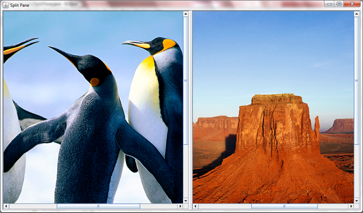
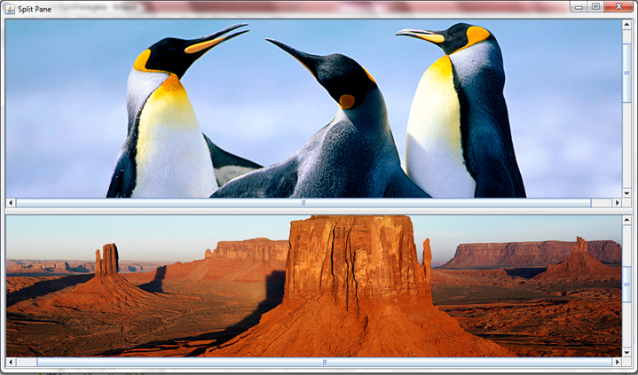
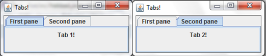

Complex Interfaces
===

## JSplitPane
You have known how to put an image onto the screen and add scroll bars to it if it is too big since part II. But, what if you want to put two images on to the screen next to each other, and want to be able to dictate just how much space each image takes up? For that purpose you can use a `JSplitPane`. This is a pane that contains two images and has a functionality with which you can change how much of the screen each image takes. To do this you will have to import `javax.swing.JSplitPane`, and will have to declare a new `JSplitPane`. Inside the parameters however, you will have to add some other things, including scroll bars (because otherwise you will not be able to dictate how much of each picture you see). The declaration will end up looking like this:

```java
JSplitPane split = new JSplitPane(JSplitPane.HORIZONTAL_SPLIT, new JScrollPane(label1), new JScrollPane(label2));
//where 'label1' and 'label2' are predeclared labels.
```

Then, in the constructor, you set those labels to be your images of choice and add the split pane to the JFrame. This particular piece of code, along with all of the other things needed for it to function, cretes this:



You could also change the `HORIZONTAL_SPLIT` to `VERTICAL_SPLIT`, but that would not be very good for our penguins health:



He seems to now have a massive mound of rock instead of a body.

## JTabbedPane
Assume you have two windows, and wish to be able to switch between them at will, because they have different pieces of information for example. To do this you could use a variety of things, but one of the better ones is a `JTabbedPane`. This is not the most useful way of doing this - it would be far more useful to use the card layout. However, I think that this looks slightly better. To use a JTabbedPane you have to declare and instantiate a `JTabbedPane`, as you would do with anything else. Then you have to create two panels and two labels (or two of what you were going to put on the tabs). Then add as many tab panes as you want. Finally, add these panels to the JTabbedPane. You do this as normal, i.e. like this:

```java
tabbedPane.add("First pane", panel1);
//where 'panel1' is the name of the panel and '"First pane"' is what will be displayed on the tabs themselves
tabbedPane.add("Second pane", panel2);
add(tabbedPane);
```

This will create the following:



### Ex 1
Create your own `JTabbedPane` with two tabs, one with a message on it and one with a button that creates a message upon clicking.
