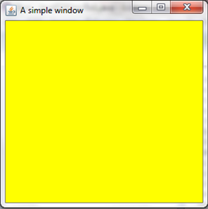
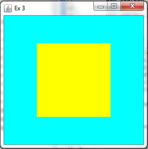

Exercises
===
Congratulations for managing to go so far.  As of now, you can consider yourself a fluent speaker of Java and Java swing. You are capable of building complex and useful GUI's. So remember that programming in swing is like playing lego: you create a new piece, add features to it: and then you add it to a bigger piece and so one. One advice to you is that you need to do more complex interface.  First do a quick sketch of what you want to achieve, think about which layout to use. If ever you have logic errors (the program compiles but the result is not the expected one) then go through your code step by step and be sure you have not forgotten to put the `setVisible()` that your size are correct; that you have correctly added the elements; at all times you must bear in mind that the computer is a big baby and you have to specify everything!

When programming in Java Swing, here are a few things you want to be careful:
- Do not forget to set your window visible.
- Check that you have correctly added each component to their correct element.
- Be careful that you correctly declare your layouts and that nothing oversteps.
- When you use buttons either be sure that your elements are final or that you are using the other method.

### Ex 1
Create the following window without using panels:

### Ex 2 
Create the same window but this time use panels.

### Ex 3
Create the following window:

**Tools:** 
You are going to have to use the following method:
setBorder(BorderFactory.createEmptyBorder(integer, integer, integer, integer)). You apply it to any JPanel or JFrame and it creates an inner empty border with the parameters (top, left, bottom, right).

### Ex 4
Create the following window:

### Ex 5
Create a program that through the command line asks for an input which will then be added to a GUI. E.g.: If I input "hello there" the following is displayed:

Hint: you may want to have a quick look at how to use scanner again.

### Ex 6
Create the following window:

### Ex 7
Create the following GUI. If the left button is clicked, it should open a new red window and 
close the main window. If the right button is clicked a blue window should open and the main window should close.

### Ex 8
Create the following window, and if the button is clicked it should create 10 red simple windows at 10 random locations (have fun closing them afterwards):

**Tools:**
- The random method is `Math.random()` it returns a double value between 0 and 1. Therefore, following the formula **minimum + (int)(Math.random()*maximum)** returns you a random integer between the minimum and maximum.
- The method `setLocation(integer, integer)` is applied to JFrames and it sets their location at the specified coordinates.

### Ex 9
Create the following window:

Hint: you can set the background of a JTextArea just like you would for a JPanel or a JFrame.

### Ex 10
Create the following window, and when the button is clicked it should change the question "how old are you?" to a phrase related to the age. E.g. if I write "18" the text is changed to "have you started UCAS?"

### Ex 11
Create the same window as exercise10 only this time use the `implements ActionListener` and the `public void actionPerformed(ActionEvent e) {}` method.

### Ex 12
Write a program that checks if a number is prime or not. You might want to create a method that returns a boolean if a number is prime or not.

### Ex 13
Inspiring yourself from exercise 13 create a program that displays the first 20 prime numbers. You will want to use JTextAreas.

### Ex 14
Create the following window that converts values of temperature:

### Ex 15
Just like the previous exercise, create a program that after asking you to choose between a temperature converter or an angle converter either displays an angle converter (degree/radian) or a temperature converter (the same as above) based on what the yser chose.

### Ex 16
Create a program that, using scanner, asks you to input positive numbers until you input a negative one, after which it creates a GUI with the following information: 
- the minimum value 
- the maximum value 
- the average

E.g. if you enter these numbers: 1.1, 2.3, 5.6, 7.8, -1 you have this returned to you:

### Ex 17
Create a method calculator just like this one:

The two methods here are the square root and cosine.

HINT: For cosine apply the method `Math.cos(integer)`.

### Ex 18-20
Throughout these next exercise you will create the following calculator:

1. Just create the layout and the design of the calculator. Try to keep your code as 
clear as possible.
2. Try to make the plus, equal and reset button operational.
3. Apply the same technique as previously and make all the buttons active.

HINT: Create two labels, one that shows the intermediate results and the final result whereas the other shows what number you have entered. You can then fetch the numbers clicked from the second label. Each operation should have a boolean variable that activates itself once the operation is activated and at the next operation should do the calculations with the new number entered.
