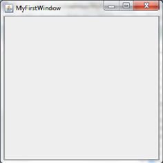
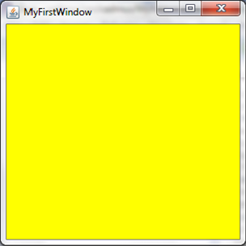

MyFirstWindow
===

Chapter 2 is all about Graphics. To make your first GUI (graphical user interface) application you need to import the package `javax.swing.JFrame`. Here is an example of an empty window:

```java
public class MyFirstWindow extends JFrame {
  public static void main(String[] args) {
    new MyFirstWindow();
  } 
  public MyFirstWindow() {
    setSize(300, 300);
    setTitle("MyFirstWindow");
    setVisible(true);
    setDefaultCloseOperation(EXIT_ON_CLOSE);
  }
}
```

Here, the class `MyFirstWindow` inherits, thanks to the `extends` keyword, all of properties and methods of the `JFrame`. That means an object of a `MyFirstWindow` is also, in essense, and object of `JFrame`. The difference is in the custom methods of `MyFirstWindow` such as the constructor, where the title, size, and visibility are set. You may say that `setTitle`, `setSize`, and `setVisible` do not exist, but they are extended `JFrame` methods. `setDefaultCloseOperation(EXIT_ON_CLOSE)`, meanwhile just ensures that the Java app doesn't lay running hidden in the background.

The code above should output this when run:



## Colouring these Windows
These windows are not limited to a dull, boring grey, in fact these windows can be set to pretty much any colour under the Sun. To do this you will have to import `Color`, using the import:

```java
import java.awt.Color;
```

To use this import you will have to use the following syntax:

```java
getContentPane().setBackground(Color.YELLOW);
// this will create a yellow window, however you can replace this with other colours.
```

As you can see, you can change the colour of your background using the method `setBackground(Colour)`. There are wide range of existing colours like:

Color.PINK, Color.GREEN, Color.BLACK, Color.Yellow, Color.BLUE, Color.RED, Color.WHITE, Color.CYAN, Color.ORANGE

It is unfortunate that due to the current American political hegemony, Java Swing has chosen to propagate their establishment's idiocratic lexical fallacies i.e. by spelling colour without the "u". If you were confused, don't worry colour is still spelt with a "u" in proper English.


This particular piece of code would putput the following:



### Ex 1
Copy & run the code. Play around with `setSize`, `setTitle`, `setVisible` and `setBackground()`.

### Ex 2
Research the `setResizable()` method and create another window called `MySecondWindow` which cannot be resized.
HINT: You don't actually need to research it, it either can or cannot be resized.
