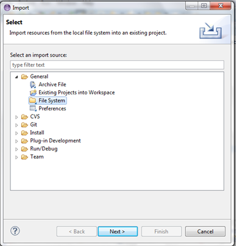
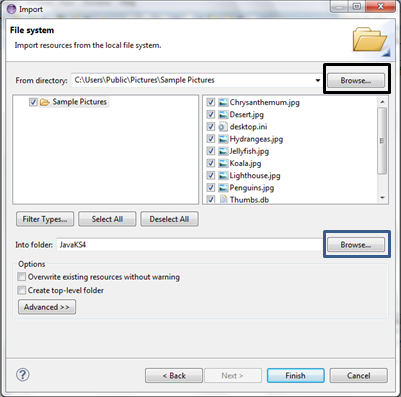
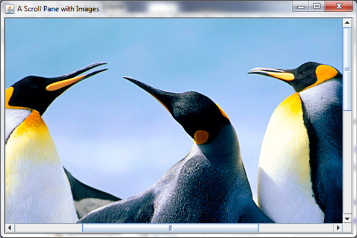

HelloWorld
===

In the last part, we created an empty window; now we want to add some text to it. We will create a class that extends the JFrame from HelloWorld just like last time, but this time our class will have a property called `label` that will be an instance of the class `JLabel`. We will also use an instance of the `FlowLayout` class to organise the elements on screen. The following imports will be needed:

```java
import java.awt.FlowLayout;
import javax.swing.JFrame;
import javax.swing.JLabel;
```

Here is the code, copy it and we'll discuss it later:

```java
public class HelloWorld extends JFrame {
    JLabel label = new JLabel("Hello World", JLabel.CENTER);

    public static void main(String[] args) {
        new HelloWorld();
    }

    public HelloWorld() {
        add(label);

        setLayout(new FlowLayout());
	    setSize(300, 70);
	    setTitle("Hello World");
	    setVisible(true);
	    setDefaultCloseOperation(EXIT_ON_CLOSE);
	}
}
```

Notice the constructor for the `JLabel`: it takes in two parameters, both of which are optional. The first is its text, the second is its alignment. We then use the `add()` method to add it to the window. Also notice how the `setLayout()` method is used to set the **layout manager** to a new instance of a `FlowLayout`. 

This should be outputted:


### Ex 1
Play around with it. Try adding another `JLabel` with a different greeting. You may have to change the second parameter, the height parameter, of `setSize()` to fit it in. You will have to add another call to the `add()` method.

## Adding Pictures to JLabels
It may not say it outright, but this part is desgined to show you how to create something and add it to a JFrame, in particular, JLabels. But these JLabels are far more useful than just displaying a line of text. They can be changed on the push of a button, can be attached to almost anything and can display images, which is what this is about.

To set a JLabel (or a button, but you'll see that later) to contain an image, first you have to import the image into Eclipse. To do this, find an image and save it to your computer. Then, in Eclipse, click **File** in the top bar, and then click **Import**. This should give you the following screen:



Then choose your file source, which will most likely be General->File System. This will then give you this:



I have already filled this in. I have taken my pictures from the Sample Pictures folder, which I got when I clicked the Browse button (bordered in black) and followed the path Libraries->Pictures->Public Pictures->Sample Pictures. However you could store your images anywhere and find them. I then chose the folder to import them to using the **Browse** button (bordered in blue) and chose the folder JavaKS4, which is simply one of my folders.

That will import your images and make them easy to access. Now, back to the point. To create an image you will need to import `javax.swing.ImageIcon` and use code similar to this:

```java
public class ImagesExample extends JFrame {
	ImageIcon image;
	JLabel label;
	//declares an ImageIcon(which the image is defined as) and a JLabel.
	
	public imagesExample() {
		image = new ImageIcon("Tulips.jpg"); // sets the ImageIcon to be Tulips.jpg
		label = new JLabel(image); // set the JLabel to be the image.
		
		add(label);

		setSize(1024, 800);
		setVisible(true);
		setDefaultCloseOperation(EXIT_ON_CLOSE);
		setTitle("An Image");
	}
	
	public static void main(String[] args) {
		new ImagesExample();
	}
}
```

This should output the following, only it would be the size of the screen:


### Ex 2
Try it yourself. Also research the `getIconWidth()` and `getIconHeight()` of `ImageIcon` and try them out too.

## Scrollable Images
I just mentioned that the image will be the size of the screen, but what if the image is larger? In that case you would lose some of the image. For this reason it would be useful to have scroll bars so you could see all of the image. To do this you need to import `javax.swing.JScrollPane`. These scroll panes are very useful, as now your images can be infinite in size. To use these you will have to declare a new scroll pane first:

```java
JScrollPane scroller = new JScrollPane();
```

Then adding this to the constructor:

```java
scroller = new JScrollPane(label);
//where 'scroller' is the name of the JScrollPane and 'image' is the name of the JLabel with an image on it

scroller.setVerticalScrollBarPolicy(JScrollPane.VERTICAL_SCROLLBAR_ALWAYS);
//sets the vertical scroll bar to always be showing, regardless whether or not it is in use

scroller.setHorizontalScrollBarPolicy(JScrollPane.HORIZONTAL_SCROLLBAR_ALWAYS);
//sets the horizontal bar in the same way as the vertical bar 

add(scroller);
//adds the scroller and therefore the image too
```

You have just added the image to the scroll pane and added the scroll pane to the JFrame. This means that now, however big the image is, you can now see it. You can also, if you so wish, shorten the first three lines to: 

```java
scroller.setViewportView(image);
```

However this gives a lot less control over the scroll bars, for example without it you can set the bars to be on the image as needed, all the time or not at all. You can therefore create an image like this:



### Ex 3
Import more images and put the on JLabels. If the image is very big, add scroll bars to it. Also, explore the different scroll bar policies i.e. `VERTICAL_SCROLLBAR_ALWAYS`, `VERTICAL_SCROLLBAR_AS_NEEDED` and `VERTICAL_SCROLLBAR_NEVER`.

## JSplitPane
Now you can put an image onto the screen and add scroll bars to it if it is too big. But what if you want to put two images on to the screen next to eachother, and want to be able to dictate just how much space each image takes up? For that purpose you can use a `JSplitPane`. This is a pane that contains two images and has a functionality with which you can change how much of the screen each image takes. To do this you will have to import `javax.swing.JSplitPane`, and will have to declare a new `JSplitPane`. Inside the parameters however, you will have to add some other things, including scroll bars (because otherwise you will not be able to dictate how much of each picture you see). The declaration will end up looking like this:

```java
JSplitPane split = new JSplitPane(JSplitPane.HORIZONTAL_SPLIT, new JScrollPane(label1), new JScrollPane(label2));
//where 'label1' and 'label2' are predeclared labels.
```

Then, in the constructor, you set those labels to be your images of choice and add the split pane to the JFrame. This particular piece of code, along with all of the other things needed for it to function, cretes this:


You could also change the `HORIZONTAL_SPLIT` to `VERTICAL_SPLIT`, but that would not be very good for our penguins health:


He seems to now have a massive mound of rock instead of a body.
